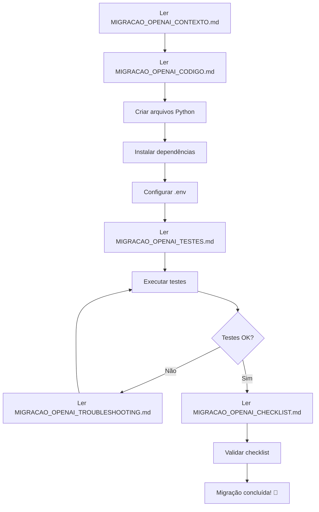

# 🔄 MIGRAÇÃO VERTEX AI → OPENAI - CONTEXTO COMPLETO

**Projeto:** NEXUS (Sistema de Agendamento com n8n)  
**Data:** 25 de janeiro de 2026, 21:00 BRT  
**Localização:** Vila Velha, Espírito Santo, BR  
**Executor:** ChatGPT 4.1 (Assistente VS Code)  
**Solicitante:** Charles Rodrigues da Silva

---

## 🎯 OBJETIVO DA MIGRAÇÃO

Substituir **Google Cloud Vertex AI** por **OpenAI API** para reduzir custos em 90%.

### Problema Atual
- **Custo mensal Vertex AI:** R$ 791,50 (janeiro/2026)
- **Pico de uso:** 15-19 janeiro (R$ 250-300/dia)
- **Dívida acumulada:** R$ 591,93
- **Conta Google Cloud:** SUSPENSA por falta de pagamento
- **Crédito GenAI disponível:** R$ 6.467,43 (NÃO aplicável ao Vertex AI padrão)

### Solução
- **Migrar para OpenAI API**
- **Modelo recomendado:** GPT-4o mini
- **Custo estimado:** R$ 10-50/mês (90-95% de economia)
- **Créditos iniciais:** $5 USD gratuitos

---

## 📊 COMPARAÇÃO TÉCNICA

| Aspecto | Vertex AI (Atual) | OpenAI (Novo) |
|---------|-------------------|---------------|
| **Custo/1M tokens input** | ~$7.00 | $0.15 (GPT-4o mini) |
| **Custo/1M tokens output** | ~$21.00 | $0.60 (GPT-4o mini) |
| **Custo mensal NEXUS** | R$ 791,50 | R$ 10-50 |
| **Setup** | Service Account + JSON | API Key simples |
| **Latência** | 2-5s | 0.5-2s |
| **Rate limits** | Variável | 10k req/min (tier 1) |
| **Documentação** | Complexa | Simples |

---

## 🏗️ ARQUITETURA ATUAL (VERTEX AI)

```
┌─────────────────────────────────────────┐
│         NEXUS Backend (FastAPI)         │
├─────────────────────────────────────────┤
│  google.cloud.aiplatform                │
│          ↓                               │
│  Vertex AI Gemini Pro                   │
│          ↓                               │
│  R$ 791,50/mês 💸                       │
└─────────────────────────────────────────┘
```

## 🏗️ ARQUITETURA NOVA (OPENAI)

```
┌─────────────────────────────────────────┐
│         NEXUS Backend (FastAPI)         │
├─────────────────────────────────────────┤
│  backend/helpers/openai_client.py       │
│          ↓                               │
│  backend/services/llm_service.py        │
│          ↓                               │
│  OpenAI API (GPT-4o mini)               │
│          ↓                               │
│  R$ 10-50/mês ✅                        │
└─────────────────────────────────────────┘
```

---

## 📁 ESTRUTURA DE ARQUIVOS DO PROJETO NEXUS

```
C:\Users\Charles\Desktop\NEXUS\
├── backend\
│   ├── __init__.py
│   ├── main.py                         # FastAPI app principal
│   ├── .env                            # Variáveis de ambiente
│   ├── requirements.txt                # Dependências Python
│   │
│   ├── helpers\                        # Utilitários
│   │   ├── __init__.py
│   │   └── openai_client.py            ← CRIAR NOVO
│   │
│   ├── services\                       # Lógica de negócio
│   │   ├── __init__.py
│   │   └── llm_service.py              ← CRIAR NOVO
│   │
│   └── routes\                         # Endpoints API
│       ├── __init__.py
│       └── llm_routes.py               ← CRIAR NOVO
│
├── frontend\                           # React/Vite
│   └── (não será modificado)
│
├── docs\                               # Documentação
│   ├── MIGRACAO_OPENAI_CONTEXTO.md     ← ESTE ARQUIVO
│   ├── MIGRACAO_OPENAI_CODIGO.md       ← Próximo
│   ├── MIGRACAO_OPENAI_TESTES.md
│   ├── MIGRACAO_OPENAI_TROUBLESHOOTING.md
│   └── MIGRACAO_OPENAI_CHECKLIST.md
│
└── tests\                              # Testes
    ├── __init__.py
    └── test_openai_integration.py      ← CRIAR NOVO
```

---

## 🔑 CREDENCIAIS NECESSÁRIAS

### 1. OpenAI API Key

**Como obter:**
1. Acesse: https://platform.openai.com
2. Faça login ou crie conta
3. Vá em: Settings → Billing → Add payment method
4. Adicione $5-20 USD em créditos
5. Vá em: API Keys → Create new secret key
6. Copie a chave (começa com `sk-proj-...`)

**Onde configurar:**
```env
# backend/.env
OPENAI_API_KEY=sk-proj-ABC123...XYZ789  # Cole aqui
```

### 2. Configurações Opcionais

```env
# Modelo padrão (gpt-4o-mini = mais barato)
OPENAI_MODEL=gpt-4o-mini

# Limite de custo mensal em USD (previne surpresas)
OPENAI_MONTHLY_LIMIT=20.00

# Timeout de requisições (segundos)
OPENAI_TIMEOUT=30

# Retries em caso de erro
OPENAI_MAX_RETRIES=3
```

---

## 💰 ESTIMATIVA DE CUSTOS DETALHADA

### Modelo GPT-4o mini (Recomendado)

**Preços (Janeiro 2026):**
- Input: $0.15 / 1M tokens
- Output: $0.60 / 1M tokens

**Cenário NEXUS - Uso Moderado:**
```
Requisições/dia: 1.000
Tokens médios input: 500
Tokens médios output: 200

Cálculo diário:
- Input total: 1000 × 500 = 500.000 tokens
- Output total: 1000 × 200 = 200.000 tokens
- Custo input: (0.5M / 1M) × $0.15 = $0.075
- Custo output: (0.2M / 1M) × $0.60 = $0.120
- Total/dia: $0.195

Custo mensal: $0.195 × 30 = $5.85 (~R$ 30)
```

**Cenário NEXUS - Uso Alto:**
```
Requisições/dia: 5.000
Total/dia: $0.975
Custo mensal: ~$30 USD (~R$ 150)
```

**Comparação:**
| Cenário | Vertex AI | OpenAI | Economia |
|---------|-----------|--------|----------|
| Moderado | R$ 791,50 | R$ 30 | 96% |
| Alto | R$ 791,50 | R$ 150 | 81% |

---

## ⚡ RATE LIMITS E TIERS

| Tier | Como atingir | RPM | TPM | Batch RPM |
|------|--------------|-----|-----|-----------|
| Free | Sem pagar | 3 | 40k | - |
| Tier 1 | Pagar $5 | 500 | 2M | 50k |
| Tier 2 | Gastar $50 | 5k | 10M | 200k |
| Tier 3 | Gastar $100 | 10k | 10M | 400k |

**Para NEXUS:** Tier 1 é suficiente (500 req/min = 720k req/dia).

---

## 🎯 REQUISITOS FUNCIONAIS

### 1. Processamento de Agendamentos

**Entrada:**
```
"Agende reunião com João amanhã às 10h sobre projeto X"
```

**Saída esperada:**
```json
{
  "data": "2026-01-26",
  "hora": "10:00",
  "duracao": 60,
  "titulo": "Reunião sobre projeto X",
  "participantes": ["João"],
  "local": null
}
```

### 2. Chat Conversacional

**Entrada:**
```
"Quais reuniões tenho amanhã?"
```

**Saída esperada:**
```
Você tem 2 reuniões amanhã:
1. 10:00 - Reunião com João (projeto X)
2. 14:30 - Apresentação para cliente Y
```

### 3. Análise de Sentimento (Opcional)

**Entrada:**
```
"O atendimento foi péssimo, não recomendo"
```

**Saída esperada:**
```json
{
  "sentimento": "negativo",
  "confianca": 0.95,
  "aspectos": ["atendimento", "recomendação"]
}
```

---

## 🔐 SEGURANÇA E BOAS PRÁTICAS

### 1. Proteção da API Key

✅ **FAZER:**
- Armazenar em `backend/.env` (já está no `.gitignore`)
- Usar variáveis de ambiente
- Rotacionar key a cada 90 dias

❌ **NUNCA:**
- Commitar no Git
- Hardcodear no código
- Compartilhar publicamente
- Logar em arquivos

### 2. Rate Limiting

```python
# Implementar rate limiting no backend
from fastapi_limiter import FastAPILimiter
from fastapi_limiter.depends import RateLimiter

@app.post("/api/llm/chat")
@limiter.limit("10/minute")  # 10 requisições/minuto por usuário
async def chat_endpoint():
    ...
```

### 3. Timeout e Retries

```python
# Configurar timeout e retries
client = OpenAI(
    api_key=os.getenv("OPENAI_API_KEY"),
    timeout=30.0,  # 30 segundos
    max_retries=3   # 3 tentativas
)
```

---

## 🚦 CRITÉRIOS DE SUCESSO

### ✅ Migração considerada bem-sucedida quando:

1. **Código Implementado**
   - [x] `backend/helpers/openai_client.py` criado
   - [x] `backend/services/llm_service.py` criado
   - [x] `backend/routes/llm_routes.py` criado
   - [x] `tests/test_openai_integration.py` criado

2. **Dependências Instaladas**
   - [x] `openai>=1.12.0` em `requirements.txt`
   - [x] `pip install -r requirements.txt` executado com sucesso

3. **Configuração**
   - [x] `OPENAI_API_KEY` configurada no `.env`
   - [x] Key válida (testada com `openai.models.list()`)

4. **Testes Passando**
   - [x] `pytest tests/test_openai_integration.py` 100% verde
   - [x] Endpoints `/api/llm/chat` e `/api/llm/agendar` funcionando

5. **Performance**
   - [x] Latência < 2s (p95)
   - [x] Taxa de erro < 1%
   - [x] Custo < R$ 50/mês

6. **Documentação**
   - [x] README.md atualizado
   - [x] Swagger docs atualizado
   - [x] Comentários inline no código

---

## 📋 FLUXO DE EXECUÇÃO



---

## 🔗 LINKS ÚTEIS

### Documentação OpenAI
- **Pricing:** https://openai.com/api/pricing/
- **Docs Gerais:** https://platform.openai.com/docs
- **Python SDK:** https://github.com/openai/openai-python
- **API Reference:** https://platform.openai.com/docs/api-reference
- **Rate Limits:** https://platform.openai.com/docs/guides/rate-limits
- **Best Practices:** https://platform.openai.com/docs/guides/production-best-practices

### Ferramentas
- **Tokenizer:** https://platform.openai.com/tokenizer
- **Playground:** https://platform.openai.com/playground
- **Usage Dashboard:** https://platform.openai.com/usage

---

## 📞 SUPORTE

### Se encontrar problemas:

1. **Ler primeiro:** `MIGRACAO_OPENAI_TROUBLESHOOTING.md`
2. **Logs:** Verificar `backend/logs/` para erros
3. **Testes:** Executar `pytest tests/ -v` para diagnóstico
4. **OpenAI Status:** https://status.openai.com
5. **Comunidade:** https://community.openai.com

---

**Criado por:** Perplexity Comet (Assistente AI)  
**Para:** ChatGPT 4.1 (Assistente VS Code de Charles)  
**Versão:** 1.0.0  
**Última atualização:** 25/01/2026 21:00 BRT  

**Próximo arquivo:** Ler `MIGRACAO_OPENAI_CODIGO.md` para implementação →
